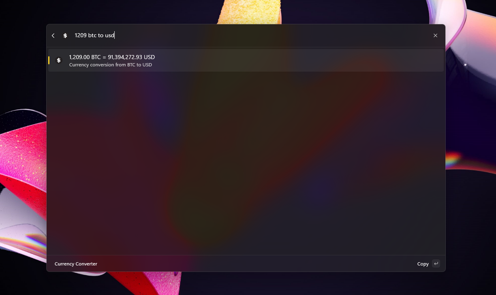
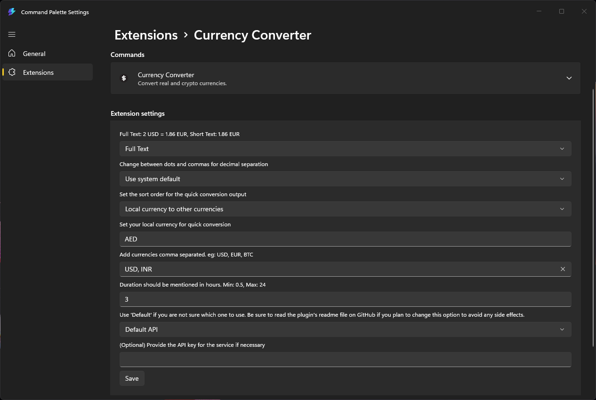
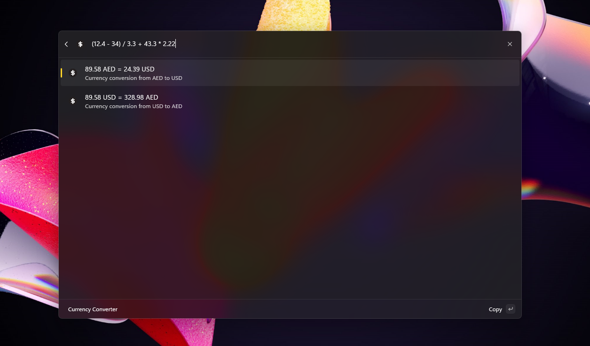
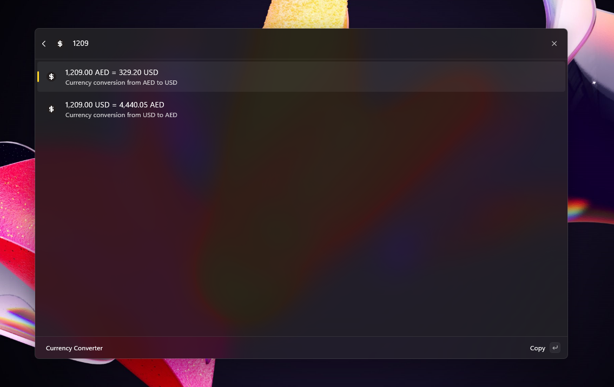

# Currency Converter

Command Palette extension which will convert real and crypto currencies.



> Note: This is a port of the [PowerToys Run Currency Converter](https://github.com/advaith3600/powertoys-run-currency-converter) plugin and some of the features including the aliasing is not working yet. 



## Usage

```
100 inr to usd
eur 100 in usd

$100
100R$
100€
100₽
₹100
$100 to eur
100$ to euro
```

### Crypto and other currencies

This plugin also converters real currencies to crypto currencies and vice versa. Refer [here](https://cdn.jsdelivr.net/gh/fawazahmed0/currency-api@1/latest/currencies.json) for the full list of available conversions. 

Example Usage:

```
1 btc to usd
```



### Quick Conversions

You can swiftly convert from your local currency to another currency simply by typing the number. The settings allow you to change both the local and all other currencies.

```
102.2
```



### Output formatting and precision

The plugin supports two modes of output:

1. Short Text: The output will only contain the target currency.
2. Full Text: The output will contain both the source and target currencies.

The plugin outputs values using dynamic precision. This means that if a value is less than 1, the number of non-zero decimals displayed will be exactly as the system configuration.

### Mathematical Calculations

You can input mathematical expressions, and the plugin will evaluate them using the BODMAS rule. The permitted operations are `+` (addition), `-` (subtraction), `*` (multiplication), and `/` (division). The use of brackets is also supported.


## Conversion API

This plugin internally uses various APIs for the latest conversion rates:

1. **Default: [fawazahmed0/exchange-api](https://github.com/fawazahmed0/exchange-api)**
   - This API is refreshed every day at midnight.
   - It is **free** and **unlimited**, and therefore no API key is required.
   - **Important:** Do not change from the default unless it is absolutely necessary. The default API provides reliable daily updates and does not require any additional setup.

2. **[ExchangeRateAPI](https://www.exchangerate-api.com/)**
   - Updates: The ExchangeRateAPI is updated frequently throughout the day. You can read more about it [here](https://www.exchangerate-api.com/#pricing).
   - Free Tier: Offers a free tier that allows for 1,500 requests per month.
   - Note: This API does not support cryptocurrency conversions.
   - Details: Please refer to the CurrencyAPI documentation for specific details on update frequency, pricing, and supported features.

3. **[CurrencyAPI](https://currencyapi.com)**
   - Updates: The CurrencyAPI is updated frequently throughout the day. You can read more about it [here](https://currencyapi.com/pricing/).
   - Details: Please refer to the CurrencyAPI documentation for specific details on update frequency, pricing, and supported features.

**Please Note:** None of the APIs mentioned above are directly associated with this plugin. If you wish to use any other API for conversion rates or have suggestions for new APIs, please open a pull request (PR) to propose adding it to the plugin.