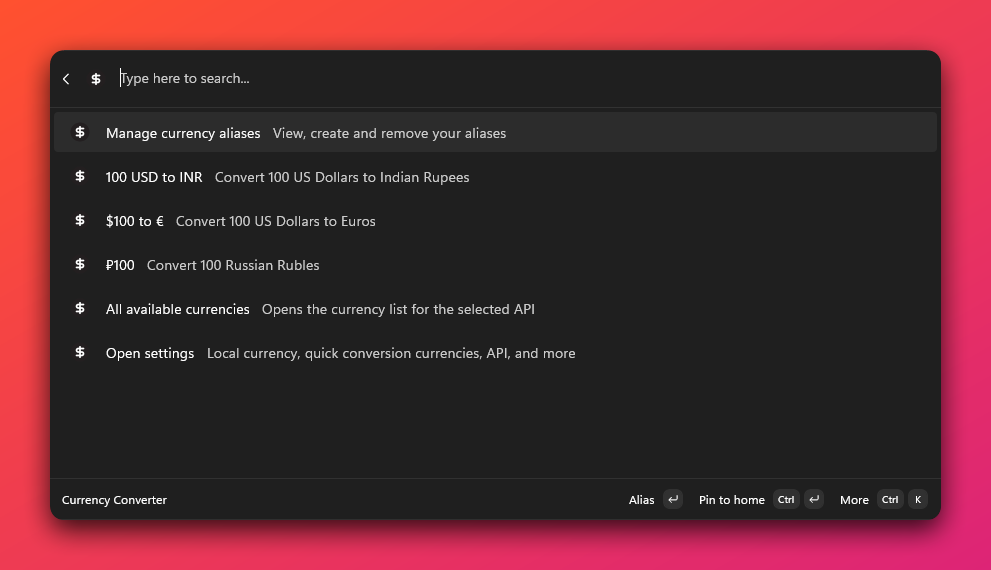
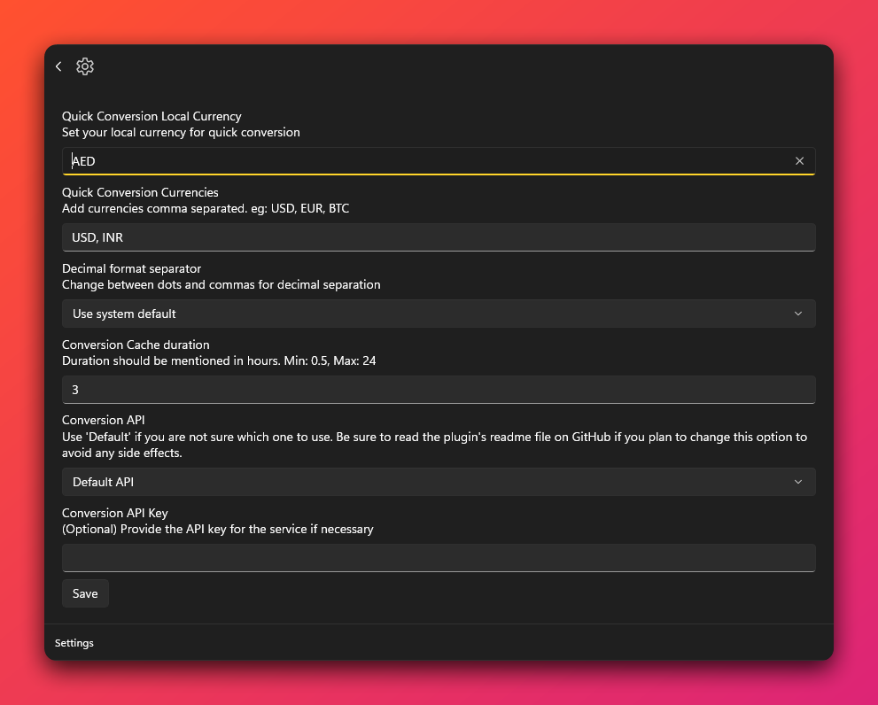
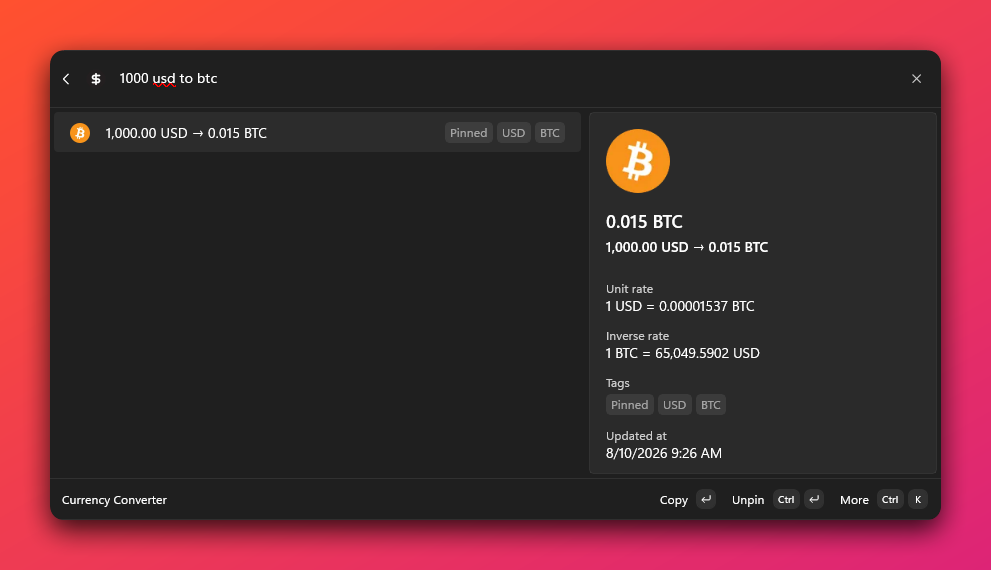
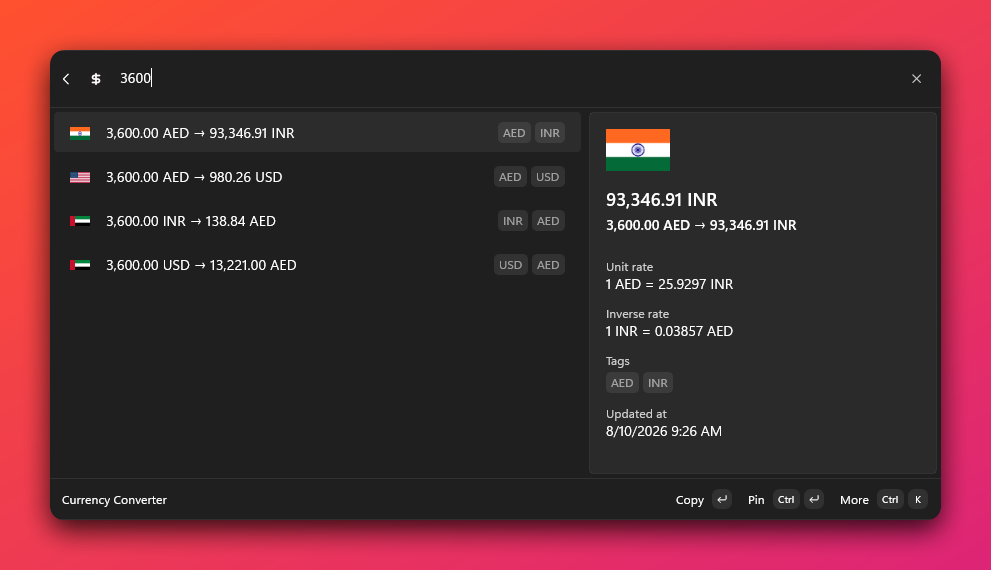
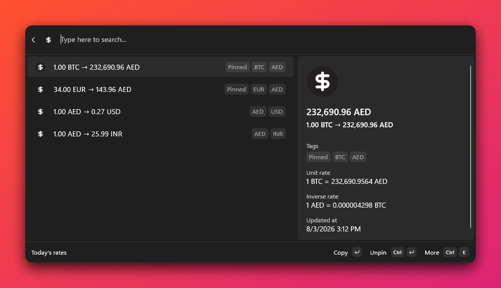
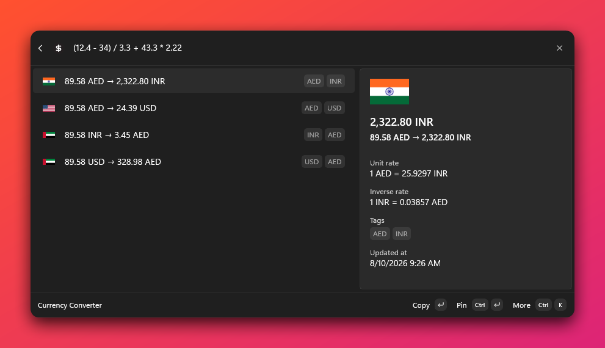
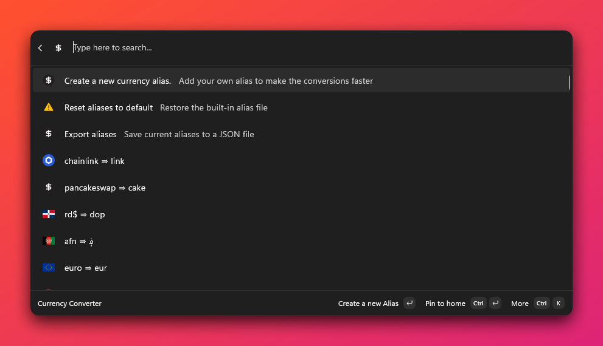
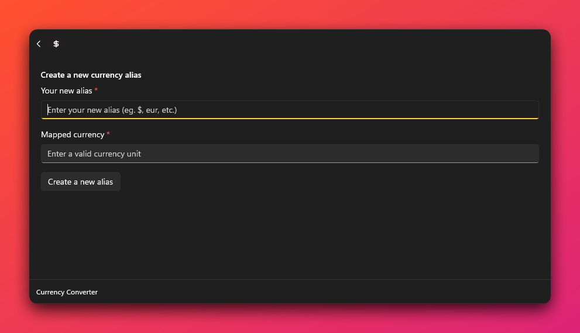

# Currency Converter

[](https://apps.microsoft.com/detail/9PC2T04G3V9C)


A [Command Palette](https://learn.microsoft.com/windows/powertoys/command-palette/overview) extension for converting between real (fiat) and cryptocurrencies — directly from your launcher.





## Installation

This extension supports both **x64** and **ARM** architectures for all installation methods below.

### Method 1: Microsoft Store

Install Currency Converter directly from the Microsoft Store. Click the badge below to open the store page:

[](https://apps.microsoft.com/detail/9PC2T04G3V9C)

### Method 2: Winget

If you have [Winget](https://learn.microsoft.com/windows/package-manager/winget/) (Windows Package Manager) installed, run:

```
winget install advaith.CurrencyConverterCommandPalette
```

### Method 3: MSIX from GitHub Releases

Download the MSIX package from the [Releases](https://github.com/advaith3600/Command-Palette-Currency-Converter/releases) page. Choose the file that matches your architecture (**x64** or **ARM**) and install it manually.

## Usage

Type a conversion in natural language. Currency codes, symbols, and mixed styles all work:

```
100 inr to usd
eur 100 in usd

$100
100R$
100€
100₽
₹100
$100 to eur
100$ to euro
```

### Crypto and other currencies

You can convert between fiat and cryptocurrencies in either direction. See the [full list of supported currencies](https://cdn.jsdelivr.net/npm/@fawazahmed0/currency-api@latest/v1/currencies.json).

```
1 btc to usd
1209 btc to usd
```



### Quick conversions

Type just a number to convert from your local currency into the other currencies configured in Settings. You can change both the local currency and the list of target currencies there.

```
102.2
$1209
```



### Today's rates

Open **Today's rates** from the main page (when the search box is empty) to see live conversions of `1` unit of your local currency into each of your other currencies from Settings.

You can also search for a specific conversion (for example `34 btc to aed`) and press **Enter** to pin it. Pinned conversions appear at the top of the page with live rates the next time you open it. Unpin with `Ctrl + Enter`.

If your local currency matches every currency in the other-currencies list, a warning is shown instead of the default rates — press **Enter** on it to open Settings and add a different currency.



### Output formatting and precision

Conversion titles always show both source and target (e.g. `2 USD → 1.86 EUR`).

Values use dynamic precision: when an amount is less than 1, the number of non-zero decimal places shown follows your system configuration.

### Mathematical calculations

You can type a math expression and the extension will evaluate it using BODMAS/PEMDAS before converting. Supported operators are `+`, `-`, `*`, and `/`, including brackets:

```
(12.4 - 34) / 3.3 + 43.3 * 2.22
```



## Aliases

Open the aliases page to view, create, and remove currency aliases. You can export your alias configuration to your Downloads folder, or reset all aliases to the built-in defaults.

Remove an alias by selecting it and pressing `Ctrl + Enter`, then confirming the prompt.





## Conversion API

This extension uses third-party APIs for the latest conversion rates:

1. **Default: [fawazahmed0/exchange-api](https://github.com/fawazahmed0/exchange-api)**
   - Refreshed every day at midnight.
   - **Free** and **unlimited** — no API key required.
   - **Important:** Keep the default API unless you have a strong reason to switch. It updates daily and needs no extra setup.

2. **[ExchangeRateAPI](https://www.exchangerate-api.com/)**
   - Updated frequently throughout the day ([pricing](https://www.exchangerate-api.com/#pricing)).
   - Free tier: 1,500 requests per month.
   - Does **not** support cryptocurrency conversions.

3. **[CurrencyAPI](https://currencyapi.com)**
   - Updated frequently throughout the day ([pricing](https://currencyapi.com/pricing/)).
   - See their documentation for update frequency, pricing, and supported features.

None of these APIs are affiliated with this extension. To use a different rate provider, or to suggest a new one, open a pull request.
